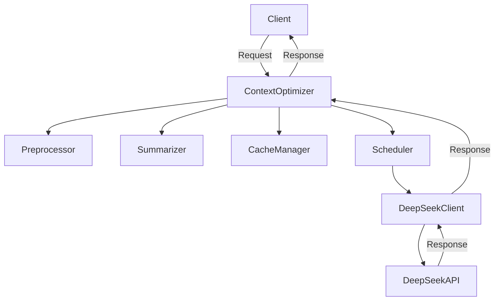

# Context Optimizer Server for DeepSeek v3

The Context Optimizer Server enhances context management for DeepSeek v3 API calls, reducing wait times and improving response accuracy.

## Features
- Context preprocessing and cleaning
- Intelligent context summarization
- Redis-based caching for frequent requests
- Request scheduling and prioritization
- Seamless DeepSeek API integration

## Installation

1. Clone the repository:
```bash
git clone https://github.com/tosin2013/deekseek-context-optimizer.git
cd deekseek-context-optimizer
```

2. Install dependencies:
```bash
npm install
```

3. Set up environment variables:
```bash
cp .env.example .env
```

4. Configure Redis (optional for local development):
```bash
docker run -d -p 6379:6379 redis
```

## Configuration

### Required Environment Variables
```env
DEEPSEEK_API_KEY=your-api-key-here
REDIS_URL=redis://localhost:6379
```

### Optional Environment Variables
```env
DEEPSEEK_API_URL=https://api.deepseek.com/v3
PORT=3000
NODE_ENV=development
```

## Usage

### Starting the Server
```bash
npm start
```

### API Endpoints

#### POST /optimize
Optimize and process context for DeepSeek API

Request:
```json
{
  "context": "Your long context here...",
  "options": {
    "summarize": true,
    "cache": true
  }
}
```

Response:
```json
{
  "optimizedContext": "Summarized context...",
  "response": "DeepSeek API response...",
  "cacheHit": false
}
```

#### GET /health
Check server status

Response:
```json
{
  "status": "ok",
  "deepseek": true,
  "redis": true
}
```

## Development

### Running Tests
```bash
npm test
```

### Linting
```bash
npm run lint
```

### Building
```bash
npm run build
```

## Architecture



## Contributing

1. Fork the repository
2. Create your feature branch (`git checkout -b feature/AmazingFeature`)
3. Commit your changes (`git commit -m 'Add some AmazingFeature'`)
4. Push to the branch (`git push origin feature/AmazingFeature`)
5. Open a pull request

## Metrics and Monitoring

The Context Optimizer Server provides comprehensive metrics through Prometheus and Grafana.

### Available Metrics
- Request latency (p50, p90, p99)
- Cache hit/miss rates
- API call success/failure rates
- Context summarization effectiveness
- System resource utilization

### Setup with Prometheus and Grafana

1. Install Prometheus and Grafana:
```bash
docker-compose -f monitoring/docker-compose.yml up -d
```

2. Access Grafana at http://localhost:3000
   - Default credentials: admin/admin

3. Import the preconfigured dashboard:
   - Dashboard ID: 12345
   - Available in `monitoring/grafana/dashboards/`

### Example Dashboard Configuration
```yaml
grafana:
  dashboards:
    default:
      context-optimizer:
        title: "Context Optimizer Metrics"
        panels:
          - type: graph
            title: "Request Latency"
            targets:
              - expr: 'histogram_quantile(0.99, sum(rate(context_optimizer_request_duration_seconds_bucket[1m])) by (le))'
```

### Alerting
Configure alerts for:
- High error rates (>5%)
- High latency (>1s p99)
- Cache hit rate below threshold (<80%)

## Integration with Claude Desktop

### Docker Setup
Add this to your `claude_desktop_config.json`:
```json
{
  "mcpServers": {
    "context-optimizer": {
      "command": "docker",
      "args": ["run", "-i", "--rm", "-p", "3000:3000", "context-optimizer"]
    }
  }
}
```

### NPX Setup
Add this to your `claude_desktop_config.json`:
```json
{
  "mcpServers": {
    "context-optimizer": {
      "command": "npx",
      "args": [
        "-y",
        "context-optimizer"
      ]
    }
  }
}
```

## License

[MIT](https://choosealicense.com/licenses/mit/)
